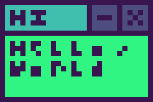

# GUI Languages Documentation

These languages are designed for EmeraldOS's graphics engine.

## GemXML `(.xml)`

GemXML is an XML-based language designed for general-purpose graphics for windows in EmeraldOS.

### Structure of a tag
```xml
<tag attribute="value">content</tag>
```

### Basic GemXML tags

- To make a window in GemXML, use the `<window>` tag as follows:
```xml
<window width="width" height="height" title="title">
	...
</window>
```
> 📝 **Note:** The `<window>` tag is required in GemXML files.<br>
> Only one window can be in a GemXML file at a time.

- The `<text>` tag can be used to specify a text element:
```xml
<text>Hello, world!</text>
```

### A Basic GemXML Window
```xml
<window width="28" height="13" title="HI">
	<text>Hello,</text>
	<text>world</text>
</window>
```
The window should, *in theory*, look something like this:
> 

### Markdown
Here is what GemXML currently uses for Markdown:
```
*Italic*
**Bold**
***Bold and italic***

# H1
## H2
### H3
```
More markdown features are still being worked on as of now.

### Containers

A `<div>` acts as a container of elements.
```xml
<div>
	...
</div>
```

### Classes and IDs

Classes and IDS can be entered as attributes:
```xml
<tag class="className" id="idName"></tag>
```

> ⚠️ Like HTML, classes can be used by multiple objects, while IDs are unique and can only be used by one object.

Unlike HTML, the GemXML compiler will crash out if you try to use an ID for 2 or more objects.

### Shapes

GemXML supports the following shapes:
- Lines (using the `<line>` tag):
```xml
<line
	startx="x" starty="y" endx="x" endy="y"
></line>
```
- Rectangles (using the `<rect>` tag):
```xml
<rect
	x="x" y="y" width="width" height="height"
></rect>
```
- Circles (using the `<circle>` tag):
```xml
<circle
	x="x" y="y" radius="radius"
></circle>
```

### Including external files
To include an external file, you can use the `<include>` tag as follows:
```xml
<include as="style">style.gms</include>
```
Currently, the only include types supported are listed here:
| Include as | File format | Purpose       |
| ---------- | ----------- | ------------- |
| `style`    | `.gms`      | Styling       |

### Default attributes

GemXML provides default values for attributes of the tags listed below.

> 📝 **Note:** Despite this, you should *always* specify an object's attributes. Otherwise, this could lead to unintended behavior.

<details>
<summary><code>&lt;window&gt;</code></summary>

- `x = 45`
- `y = 35`
- `width = 30`
- `height = 20`
</details>

<details>
<summary><code>&lt;rect&gt;</code></summary>

- `x = window.width/2 - 5`
- `y = window.height/2 - 3`
- `width = 10`
- `height = 6`
</details>

<details>
<summary><code>&lt;circle&gt;</code></summary>

- `x = window.width / 2`
- `y = window.height / 2`
- `radius = 4`
</details>

## GemSheet `(.gms)`

GemSheet is a CSS-based language.<br>
Contents of a GemSheet file can be included in a GemXML file using the `<include>` tag.

### Syntax
```
tag_name {
    attribute: value(s);
    attribute2: values(s);
    ...
}

.class_name {
    ...
}

#id {
    ...
}
```
GemSheet isn't exactly... strict, for now.
